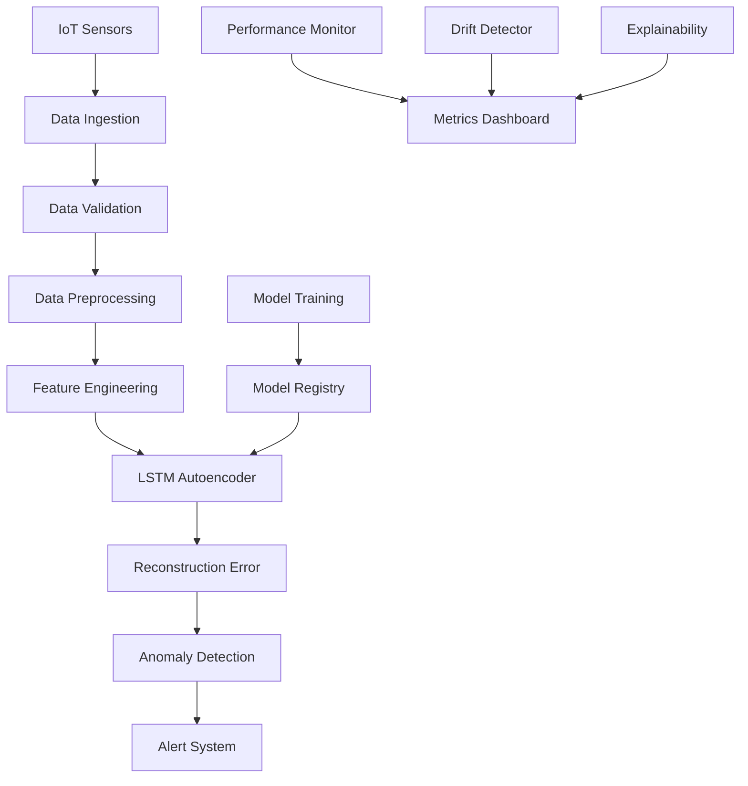

# IoT Time Series Anomaly Detection - System Architecture

## Overview

This system provides automated anomaly detection for multivariate time series data from IoT sensors using LSTM-based autoencoders. The architecture follows a modular design with clear separation of concerns and production-ready features.

## System Components

### Data Processing Layer
- **Data Generator** (`src/generate_data.py`): Simulates multivariate IoT sensor data with configurable anomaly injection
- **Data Validator** (`src/data_validator.py`): Comprehensive validation pipeline ensuring data quality and schema compliance
- **Data Preprocessor** (`src/data_preprocessor.py`): Time series preprocessing including normalization, windowing, and scaling

### Machine Learning Layer
- **Autoencoder Model** (`src/autoencoder_model.py`, `src/flexible_autoencoder.py`): LSTM-based autoencoder for learning normal patterns
- **Training Pipeline** (`src/train_autoencoder.py`): Model training with callbacks and performance monitoring
- **Model Manager** (`src/model_manager.py`): Model versioning, metadata tracking, and lifecycle management

### Detection & Inference Layer
- **Anomaly Detector** (`src/anomaly_detector.py`): Core detection logic with configurable thresholds
- **Streaming Processor** (`src/streaming_processor.py`): Real-time processing for streaming data
- **Model Serving API** (`src/model_serving_api.py`): REST API for model inference

### Monitoring & Observability Layer
- **Performance Monitor** (`src/performance_monitor_cli.py`): System performance tracking and metrics
- **Drift Detector** (`src/data_drift_detector.py`): Data distribution drift monitoring
- **Explainability** (`src/model_explainability.py`): Model interpretability and feature importance

### Operational Layer
- **Caching Strategy** (`src/caching_strategy.py`): Performance optimization through intelligent caching
- **Configuration Management** (`src/config.py`): Centralized configuration handling
- **Security Utils** (`src/security_utils.py`): Security hardening and secure data handling

## Data Flow Architecture

## Deployment Architecture

### Development Environment
- Local development with virtual environments
- Docker containers for consistent environments
- Pre-commit hooks for code quality

### Staging Environment
- Automated deployment from main branch
- Integration testing with real data samples
- Performance benchmarking

### Production Environment
- Blue-green deployment strategy
- Auto-scaling based on load
- Comprehensive monitoring and alerting

## Security Architecture

### Data Security
- Encryption at rest and in transit
- Secure credential management
- Data anonymization for non-production environments

### Application Security
- Input validation and sanitization
- Authentication and authorization
- Security scanning in CI/CD pipeline

### Infrastructure Security
- Container security scanning
- Vulnerability management
- Network segmentation

## Scalability Considerations

### Horizontal Scaling
- Microservices architecture for independent scaling
- Load balancing across multiple instances
- Distributed processing for large datasets

### Performance Optimization
- Batched inference for high-throughput scenarios
- Memory-efficient windowing strategies
- Caching for frequently accessed models

## Technology Stack

- **Core ML**: TensorFlow/Keras, scikit-learn
- **Data Processing**: Pandas, NumPy
- **Visualization**: Matplotlib, Seaborn
- **API**: FastAPI/Flask (planned)
- **Monitoring**: Prometheus, Grafana (planned)
- **Containerization**: Docker
- **CI/CD**: GitHub Actions
- **Testing**: pytest, coverage

## Quality Attributes

### Reliability
- Comprehensive error handling
- Graceful degradation under load
- Automated recovery mechanisms

### Maintainability
- Modular design with clear interfaces
- Comprehensive documentation
- Automated testing at all levels

### Performance
- Sub-second inference for real-time detection
- Optimized memory usage for large datasets
- Efficient caching strategies

### Security
- Defense in depth approach
- Regular security audits
- Compliance with security best practices

## Future Enhancements

- Distributed training for large-scale datasets
- Advanced ensemble methods
- Real-time dashboard with interactive visualizations
- Multi-tenant architecture for SaaS deployment